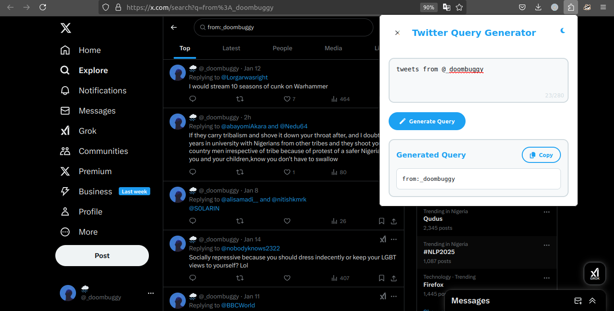

# Twitter Query Generator Firefox Extension

Convert natural language search requests into advanced Twitter search queries using AI. This Firefox extension leverages Google's Gemini AI to generate precise search operators for Twitter/X platform.


## Features

- 🤖 **AI-Powered Conversion**: Uses Gemini Pro to convert natural language to search operators
- 🔍 **Advanced Search Operators**: Supports all Twitter search filters including:
  - User filters (from:, to:, mentions)
  - Content filters (media, links, replies)
  - Engagement filters (min_retweets, min_faves)
  - Time and location filters
  - Language filters
- 🎨 **Modern UI**:
  - Dark/Light theme support
  - Real-time character counter
  - Loading animations
  - Error handling
- ⚡ **Quick Actions**:
  - One-click query generation
  - Automatic Twitter tab opening
  - Copy to clipboard functionality

## Installation

1. **Firefox Setup**:
   ```bash
   about:debugging#/runtime/this-firefox
   ```
   Click "Load Temporary Add-on" and select manifest.json

2. **API Key Setup**:
   - Get your API key from [Google AI Studio](https://aistudio.google.com/)
   - Enter key when prompted on first extension use

## Usage

1. Click the extension icon in Firefox toolbar
2. Enter your search request in natural language:
   ```
   "Show me tweets from NASA about Mars with images from last month"
   ```
3. Click "Generate Query"
4. Extension will:
   - Generate advanced search query
   - Open Twitter in new tab
   - Execute search automatically



## Technical Details

### Components
- **AI Backend**: Gemini Pro via Google's Generative Language API
- **Extension Architecture**:
  - `background.js`: API communication
  - `content.js`: Twitter DOM interaction
  - `popup/`: User interface components
- **Storage**: No user data collection

### Key Technologies
- FireFox Extensions API
- Gemini Pro LLM
- Modern JavaScript (ES6+)
- CSS Custom Properties for theming

## Permissions
| Permission | Reason |
|------------|--------|
| `tabs` | Auto-open Twitter search |
| `https://*.googleapis.com/*` | Gemini API access |
| `https://x.com/*` | Query execution on Twitter |

## Customization

1. **Styling**:
   - Modify CSS variables in `popup.html`
   - Adjust theme colors in `:root` selectors

2. **Behavior**:
   - Edit `PROMPT_TEMPLATE` in `background.js` to modify AI instructions
   - Adjust character limit in `popup.js`

## Support
**Common Issues**:
- API Errors: Verify Gemini API key
- Search Failure: Ensure Twitter UI hasn't changed
- Character Limit: Keep inputs under 280 chars

---

**Note**: This is an unofficial tool not affiliated with Twitter/X or Google. Use responsibly according to API rate limits.